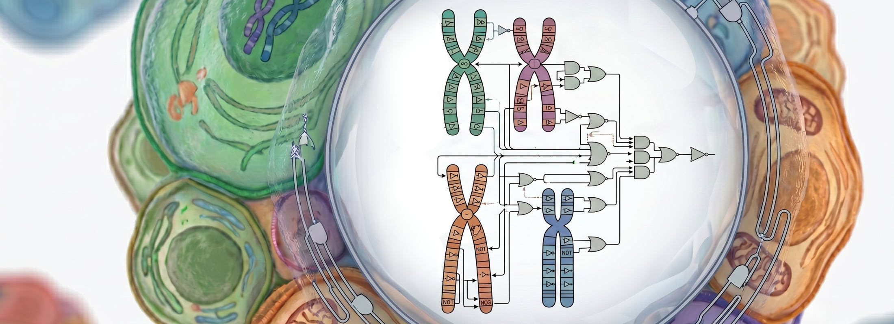

# CancerEvo: Spatial and Global Stochastic Simulation Framework for Cancer Evolution

[](https://opensource.org/licenses/MIT)


## 1. Scientific Overview & Objectives

This repository implements spatial (solid tumor on a 2D lattice) and global (liquid tumor Moran process) stochastic simulations of cancer evolution. The model tracks the accumulation of somatic mutations in five categories of genes (Instability, Oncogenes, Survival, Missegregation, and Housekeeping) and the emergence of malignant clones under selective pressure.

* **Hypothesis:** Tumor growth dynamics, persistence, and collapse are governed by the trade-off between clonal replication advantages (governed by division rate increments) and the mutational burden (governed by mutation rate increments). We hypothesize that a critical phase transition boundary separates stable/self-extinguishing tumors from explosive expansion, and that this boundary is shaped by spatial constraints and ploidy levels.
* **Methodology Summary:** The simulation engine is implemented in high-performance Julia using a Struct-of-Arrays (SoA) layout and bitwise `UInt64` chromosome representation to achieve ultra-fast cellular operations. Mathematical results derived from Master Equation stationary distributions are used to benchmark the simulation results, solved via a hybrid numerical/analytical Python solver.

---

## 2. Directory Structure & Content Descriptions

To maintain a clean and self-documenting workflow, this repository relies on a strict separation of concerns. Below is the purpose of each directory and script:

### `data/` (Git-ignored)
Contains raw, processed, and intermediate simulation outputs.
- `simulations/`: Aggregated and individual spatial solid-tumor simulation results.
- `simulations_liquid/`: Aggregated and individual liquid-tumor simulation results.
- `spatial_study/`: Data from spatial progression benchmarks.

### `src/`
Core reusable library modules (not run directly).
- **`utils_solid.jl`**: Defines data structures (`OptimizedTissue`, `OptimizedResults`) and core bitwise mutation/division functions for the solid model.
- **`utils_liquid.jl`**: Defines `LiquidTissue` and inherits rate calculation mechanics from the solid model.
- **`simulation_solid.jl`**: Implements the main solid-tumor time-stepping loop.
- **`simulation_liquid.jl`**: Implements the main liquid-tumor Moran simulation loop.
- **`simulation_solid_spatial.jl`**: Extends the solid model simulation loop to capture full spatial lattice frames.
- **`simulation_liquid_spatial.jl`**: Extends the liquid model simulation loop to capture full coordinate snapshots.
- **`interventions.jl`**: Implements therapeutic protocols (proportional cell removal, clone clearance, and mutation rate changes).
- **`analysis/`**: Python modules for downstream data processing and theory solvers.
  - `loaders.py`: Utilities to load `.npz` simulation runs and aggregate stats across ploidy levels.
  - `stats.py`: Helper functions for trajectory smoothing and phase space conversions.
  - `stationary_liquid.py`: Self-consistent root solver for liquid-tumor Master Equation stationary distributions.
  - `calculate_asymptotic_theory.py`: Calculates asymptotic subpopulation distributions and expected mutation rates using analytical product formulas.

### `scripts/`
Runnable entry points for the simulation sweeps, interventions, and plotting.

#### `scripts/solid/`
- `parameters_solid.jl`: Centralized parameter configuration for solid tumors.
- `simulation_solid.jl`: Runs a single spatial solid-tumor simulation and saves to `data/simulations/results.npz`.
- `ensemble_run_solid.jl`: Runs parallel ensembles of solid-tumor simulations.
- `stability_sweep_solid.jl`: Adaptive bisection search for the solid-tumor stability boundary.
- `parameter_phase_diagram_solid.jl`: Grid sweep over $d\mu \times dr$ to compute tumor persistence fractions.
- `run_interventions.jl`: Runs the solid-tumor model under four therapeutic intervention protocols.
- `run_single_spatial_solid.jl`: Runs single solid-tumor trajectories with fixed seeds and saves full spatial snapshots.
- `run_solid_with_actI_dist.jl`: Runs solid simulations until finding a trajectory stabilizing within a target mutation rate.

#### `scripts/liquid/`
- `parameters_liquid.jl`: Parameter configuration for the liquid model.
- `simulation_liquid.jl`: Runs a single liquid-tumor simulation.
- `ensemble_run_liquid.jl`: Runs parallel ensembles of liquid-tumor simulations.
- `stability_sweep_liquid.jl`: Grid sweep mapping the liquid-tumor stability boundary.
- `parameter_phase_diagram_liquid.jl`: Grid sweep over $d\mu \times dr$ to compute liquid tumor persistence fractions.
- `simulation_spatial_liquid.jl`: Runs a single liquid-tumor simulation and saves spatialsnapshots.
- `run_liquid_with_actI_dist.jl`: Runs liquid simulations until finding a trajectory stabilizing within a target mutation rate.

#### `scripts/plots/`
Visualization scripts that load results and output publication-quality figures.
- **`solid/`**:
  - `plot_density_vs_actI.py`: Plots subpopulation fractions by active instability class compared to theory.
  - `plot_diploid_genes_trajectory.py`: Plots O/I/HK mutation and activation levels over time.
  - `plot_ensemble_trajectories.py`: Plots ensemble-averaged density trajectories and growth speeds.
  - `plot_interventions.py`: Renders a 4-panel diagnostic of tumor density and mutation rate under therapies.
  - `plot_parameter_phase_diagram.py`: Heatmap of tumor persistence over the $d\mu \times dr$ grid.
  - `plot_single_trajectory.py`: Phase space diagnostic of individual recovery/proliferation trajectories.
  - `plot_single_trajectory_spatial.py`: Renders L×L spatial snapshot grids of WT/Cancer/Dead cells.
  - `plot_stability_sweep.py`: Phase diagram overlaying simulation stability data with analytical theory.
- **`liquid/`**:
  - `plot_density_vs_actI.py`: Plots subpopulation fractions by active instability class for the liquid model.
  - `plot_parameter_phase_diagram.py`: Heatmap of liquid tumor persistence over $d\mu \times dr$.
  - `plot_single_trajectory.py`: Phase space diagnostic of individual liquid tumor trajectories.
  - `plot_stability_sweep.py`: Phase diagram overlaying liquid simulation stability boundaries with theory.

### `outputs/`
All generated outputs are separated from code and categorized:
- `results/`: Processed CSV tables containing stability boundaries and sweep fractions.
- `figures/`: Renders of publication-quality PNG, SVG, and PDF plots organized by regime (`solid/` or `liquid/`).

---

## 3. Main Features Description

### Simulation Model
The tissue is modeled as a 2D square lattice of size $L \times L$ (or a global pool of size $N = L^2$ in the liquid Moran process). Each cell site holds state values (0 = Wild-Type, 1 = Cancer, 2 = Dead), replication rate $r$, mutation rate $\mu$, and missegregation rate $m$, alongside a set of chromosomes encoded as bitmasks. 

At each timestep:
1. **Reproduction:** Cells are selected to divide based on their replication rate. In the solid model, daughter cells are placed in local neighboring sites, displacing existing cells. In the liquid model, daughters are placed globally at random positions.
2. **Mutation:** Genes are mutated stochastically. Mutational state updates cellular rates.
3. **Missegregation:** Chromosomes may be missegregated during division, altering the ploidy level.
4. **Death:** Cells can die stochastically, or deterministically if their housekeeping genes are entirely mutated.

### Gene Types & Activation Logic
A cell contains $N_{\text{CHR}}$ copies of chromosomes. Each copy carries a set of genes:
- **Instability ($\mathcal{I}$):** 10 genes. Recessive activation (mutated on all chromosome copies) increases the mutation rate $\mu$ by $d\mu$.
- **Oncogenes ($\mathcal{O}$):** 10 genes. Dominant activation (mutated on any chromosome copy) increases the replication rate $r$ by $dr$.
- **Survival ($\mathcal{S}$):** 10 genes. Recessive activation increases the replication rate $r$.
- **Missegregation ($\mathcal{M}$):** 5 genes. Recessive activation increases the chromosome missegregation rate $m$ by $dm$.
- **Housekeeping ($\mathcal{H}$):** 10 genes. Recessive mutation of all housekeeping genes triggers cell death.

---

## 4. How to Run

### Conda Environment Setup (Python)
Ensure you have Conda installed, then create and activate the project-specific environment:
```bash
conda env create -f cancerevo-env.yml
conda activate cancerevo-env
```

### Julia Environment Setup
Start Julia in the project directory and instantiate the package dependencies:
```julia
using Pkg
Pkg.activate(".")
Pkg.instantiate()
```

### Running Simulations

#### Single Simulation Runs
To run a single simulation (saves `results.npz`):
```bash
# Solid Model (Standard non-spatial run)
julia --project=. scripts/solid/simulation_solid.jl

# Liquid Model (Standard non-spatial run)
julia --project=. scripts/liquid/simulation_liquid.jl

# Solid Model with spatial snapshot outputs (e.g. 12 snapshots)
julia --project=. scripts/solid/run_single_spatial_solid.jl 12

# Liquid Model with spatial snapshot outputs (e.g. 12 snapshots)
julia --project=. scripts/liquid/simulation_spatial_liquid.jl 12
```
* **Single spatial run arguments:**
  - `n_snapshots`: Position 1. Number of spatial lattice/coordinate snapshots to export (default: 12).

#### Parallel Ensemble Runs
To run a parallel ensemble of simulations:
```bash
# Solid Model (uses available CPU threads)
julia --project=. -t auto scripts/solid/ensemble_run_solid.jl [num_sims] [misseg_type] [suffix] [--dm value]

# Liquid Model
julia --project=. -t auto scripts/liquid/ensemble_run_liquid.jl [num_sims] [misseg_type]
```
* **Ensemble run options & arguments:**
  - `num_sims` (Positional 1): Number of parallel simulation replicates (default: 20).
  - `misseg_type` (Positional 2): Missegregation type, either `"whole"` or `"chunk"` (default: `"whole"`).
  - `suffix` (Positional 3 or via `--suffix`/`-s`): Suffix for the results output subdirectory name (default: `""`).
  - `--dm` (Flag, Solid only): Custom chromosome missegregation rate (default: `0.0`).

#### Parameter & Stability Sweeps
To map the phase boundaries and parameter spaces:
```bash
# Solid model stability sweep
julia --project=. -t auto scripts/solid/stability_sweep_solid.jl [--dry-run] [--n-rmax value]

# Liquid model stability sweep
julia --project=. -t auto scripts/liquid/stability_sweep_liquid.jl [--n-grid value] [--reps value]

# Solid model 2D parameter phase diagram sweep
julia --project=. -t auto scripts/solid/parameter_phase_diagram_solid.jl [--n-grid value] [--reps value]

# Liquid model 2D parameter phase diagram sweep
julia --project=. -t auto scripts/liquid/parameter_phase_diagram_liquid.jl [--n-grid value] [--reps value]
```
* **Stability & parameter sweep options:**
  - `--dry-run` (Solid stability sweep only): Prints the search trajectory plan without running simulations.
  - `--n-rmax value` (Solid stability sweep only): Number of grid points for division rate increment search (default: 50).
  - `--n-grid value` (Liquid stability sweep and all Phase Diagrams): Grid resolution along each axis (default: 20).
  - `--reps value` (Liquid stability sweep and all Phase Diagrams): Number of replicates per grid point (default: 25 for liquid stability sweep, 50 for phase diagrams).


### Generating Plots
Ensure your conda environment is active, then execute any plotting script:
```bash
# Example: Plotting the solid-tumor stability sweep boundary
python scripts/plots/solid/plot_stability_sweep.py

# Example: Plotting solid spatial snapshots
python scripts/plots/solid/plot_single_trajectory_spatial.py
```
All plots are exported to `outputs/figures/solid/` and `outputs/figures/liquid/`.
