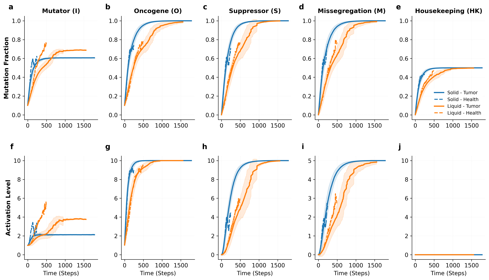
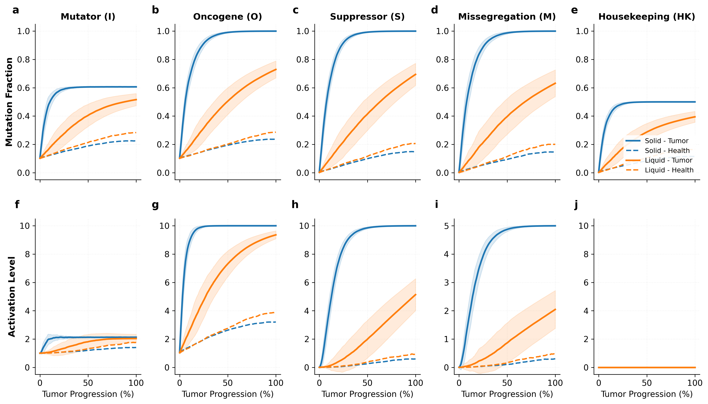
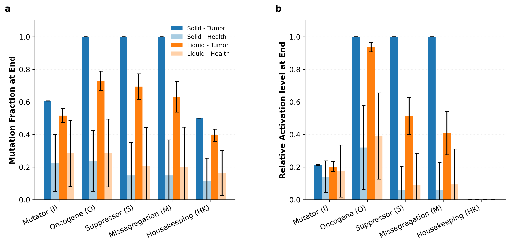

# Gene Evolution Dynamics: Solid vs. Liquid Diploid Tumors

This directory contains the code, data, and visual artifacts for analyzing the temporal evolution and stationary states of gene mutations and activations in diploid ($2\text{CHR}$) solid and liquid tumor models, comparing progressing tumors (`Tumor_Max` outcome) and cleared clones (`Health` outcome).

## 1. Scientific Overview & Key Findings

We studied how spatial configuration and selective filters affect the evolutionary trajectories of five gene classes:
- **Mutator (I) genes**: Recessive; increase mutation rate.
- **Oncogenes (O)**: Dominant; increase division rate.
- **Suppressor (S) genes**: Recessive; decrease death probability (mutations cause loss of suppressors).
- **Missegregation (M) genes**: Recessive; increase chromosome missegregation rate.
- **Housekeeping (HK) genes**: Recessive; essential for survival (homozygous mutation is lethal).

We partitioned the simulations into two outcomes:
1. **Tumor (Tumor_Max)**: The clone successfully overcomes tissue homeostasis and expands to the size threshold (50% density).
2. **Health**: The clone fails to expand and goes extinct. To capture the biological state of the tumor right before clearance, metrics are evaluated at the last active step (pre-extinction).

> [!IMPORTANT]
> **Key Evolutionary Insights**
> - **Selective Bottleneck for Progression**: A comparison of Tumor and Health states reveals that successful tumor progression is a strict selective bottleneck. Progressing tumors accumulate high driver mutation loads (near $100\%$ in Solid, $\approx 63-73\%$ in Liquid). Conversely, clones that go extinct (Health) fail to cross the fitness barrier, carrying very low mutation fractions ($\approx 15-28\%$ across drivers) at the time of clearance.
> - **Spatial vs. Liquid Barriers**: 
>   - **Solid Tumors** are spatially constrained (local replacement). To expand, they require near-perfect drivers ($100\%$ mutation in O, S, M) and grow slowly (mean steps $\approx 1574$).
>   - **Liquid Tumors** feature global mixing (global substitution), which lowers the selection barrier. Clones can expand rapidly (mean steps $\approx 491$) even while carrying fewer driver mutations ($\approx 73\%$ in O, $\approx 69\%$ in S, $\approx 63\%$ in M).
> - **Housekeeping Constraints**: Surviving cells cannot undergo homozygous HK loss. In progressing solid tumors, prolonged evolution drives HK mutations to the absolute heterozygous limit of $0.50$. In liquid tumors, shorter timescales and lower mutation rates keep it at $\approx 0.39$. In cleared clones, extinction happens before significant HK mutation accumulates ($\approx 0.11 - 0.16$).

---

## 2. Quantitative Results

The table below lists the average mutation fractions and activation levels of each gene class at the final state of the simulation (mean $\pm$ standard deviation across all runs):

| Gene Class | Metric | Solid - Tumor | Solid - Health (Pre-Extinction) | Liquid - Tumor | Liquid - Health (Pre-Extinction) |
| :--- | :--- | :--- | :--- | :--- | :--- |
| **Mutator (I)** | Mutation | $0.6063 \pm 0.0009$ | $0.2250 \pm 0.1740$ | $0.5161 \pm 0.0428$ | $0.2836 \pm 0.2028$ |
| | Activation | $2.1263 \pm 0.0180$ | $1.4035 \pm 0.9752$ | $2.0331 \pm 0.3007$ | $1.7546 \pm 1.6008$ |
| **Oncogene (O)** | Mutation | $0.9999 \pm 0.0002$ | $0.2379 \pm 0.1861$ | $0.7292 \pm 0.0598$ | $0.2865 \pm 0.2084$ |
| | Activation | $10.0000 \pm 0.0000$ | $3.2054 \pm 2.5775$ | $9.3576 \pm 0.2803$ | $3.9080 \pm 2.6442$ |
| **Suppressor (S)**| Mutation | $0.9999 \pm 0.0002$ | $0.1488 \pm 0.2030$ | $0.6943 \pm 0.0781$ | $0.2069 \pm 0.2363$ |
| | Activation | $9.9976 \pm 0.0046$ | $0.5910 \pm 1.4353$ | $5.1350 \pm 1.1262$ | $0.9294 \pm 1.9225$ |
| **Missegregation (M)**| Mutation | $0.9998 \pm 0.0003$ | $0.1488 \pm 0.2182$ | $0.6316 \pm 0.0940$ | $0.1991 \pm 0.2455$ |
| | Activation | $4.9984 \pm 0.0034$ | $0.3052 \pm 0.8295$ | $2.0442 \pm 0.6662$ | $0.4693 \pm 1.0863$ |
| **Housekeeping (HK)**| Mutation | $0.5000 \pm 0.0000$ | $0.1152 \pm 0.1390$ | $0.3945 \pm 0.0384$ | $0.1649 \pm 0.1384$ |
| | Activation | $0.0000 \pm 0.0000$ | $0.0000 \pm 0.0000$ | $0.0000 \pm 0.0000$ | $0.0000 \pm 0.0000$ |

*Note: Number of Solid runs: 139 (Tumor), 361 (Health). Number of Liquid runs: 337 (Tumor), 163 (Health).*

---

## 3. Biological & Physical Interpretation

### Why Cleared Clones (Health) Fail to Mutate
For a tumor to grow, it must out-compete healthy cells. In both solid and liquid models, clones start with a single mutated copy of the Mutator (I) and Oncogene (O) genes. 
- In progressing cases (Tumor), the tumor successfully accumulates further driver mutations (such as deactivating Suppressors or activating more Oncogenes) that boost its birth rate and lower its death rate, leading to runaway growth.
- In cleared cases (Health), the clones fail to acquire these critical driver mutations in a timely manner. Right before extinction, the average Suppressor mutation fraction is only $0.15$ in solid and $0.21$ in liquid, meaning almost all Suppressors remain active (preventing death rate reductions). Consequently, random demographic fluctuations (birth-death drift) or competition with wildtype cells drive the clone to extinction. The high standard deviations in the Health cases highlight the stochastic nature of this extinction, with clones dying at various early stages.

### Extinction Lifetimes
- **Solid Health** clones are cleared very quickly (mean step of extinction $\approx 48$) due to strict local confinement: if a cancer cell dies, its spot is likely filled by a healthy neighbor.
- **Liquid Health** clones survive longer (mean step of extinction $\approx 141$) because global mixing gives them more spatial freedom, allowing them to drift longer and accumulate slightly more background mutations before eventually succumbing.

---

## 4. Figures & Visualization

### Real-Time Evolution
The figure below shows the average temporal trajectories (solid lines for Tumor, dashed lines for Health) aligned at $t = 0$. In both solid (blue) and liquid (orange) cases, cleared clones (dashed) fail to show the upward sweep in mutations/activations and flatline before disappearing.

### Normalized-Time Evolution (Evolutionary Sequence)
By normalizing the lifetimes of each trajectory to $0-100\%$, we can compare the progression pathways. Progressing tumors (solid lines) exhibit a sharp, coordinated accumulation of driver mutations, while cleared clones (dashed lines) show a flat, drift-like profile that never crosses the selective threshold.

### Stationary States Comparison
This bar chart compares the final mutation fraction and relative activation level (normalized by number of genes of each type). It visually contrasts the high mutational load of progressing tumors (deep colors) with the low mutational load of cleared clones (light colors) right before extinction.

---

## 5. Contents of this Directory
- [analyze_genes.py](file:///home/francesco/Universita/PhD/PROJECTS/CancerEvo/gene_evolution_analysis/analyze_genes.py): Script containing data loading, interpolation, and matplotlib plotting pipelines.
- [stationary_states_summary.txt](file:///home/francesco/Universita/PhD/PROJECTS/CancerEvo/gene_evolution_analysis/stationary_states_summary.txt): Plain text output of the summary stats.
- `*.png` & `*.svg`: Dual-production figures at 300 DPI.
