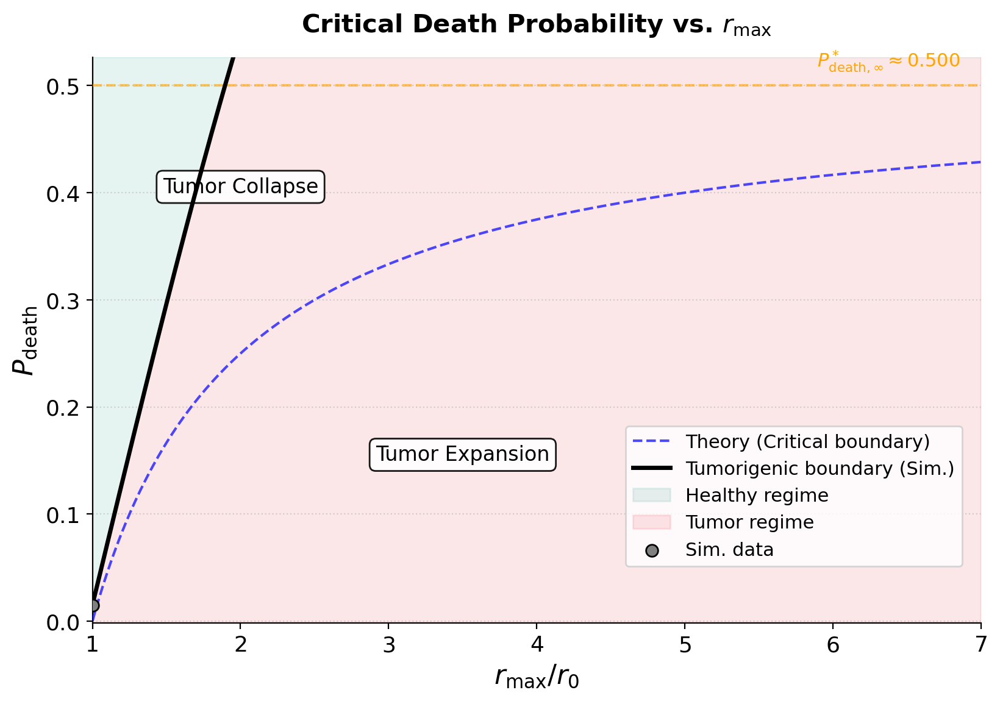
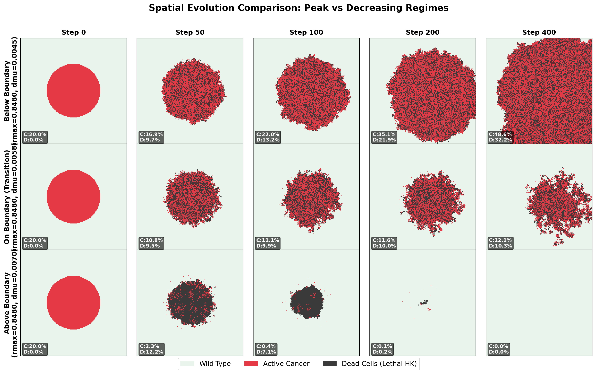
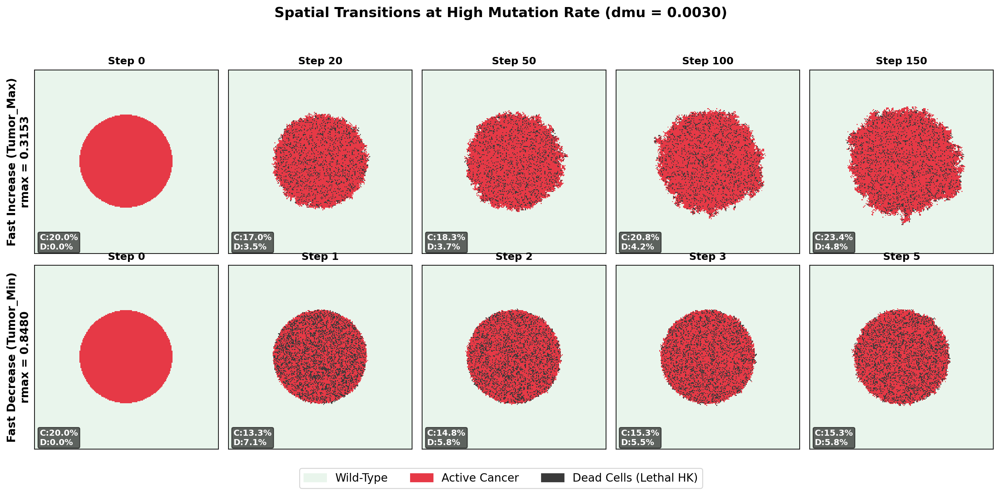
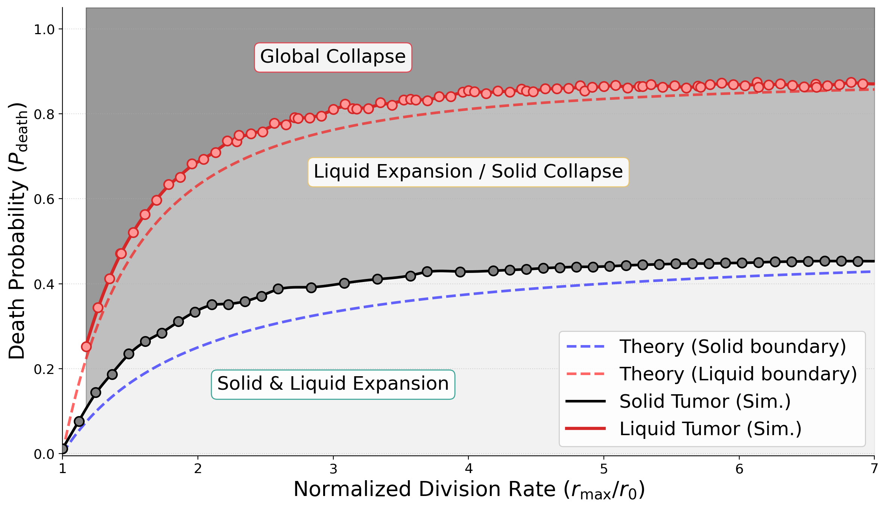

# Stability Phase Boundary Analysis: $\delta\mu^*(r_{\max})$

**Project:** CancerEvo  
**Date:** 2026-06-03  
**Scripts:** `scripts/solid/stability_sweep.jl`, `scripts/plots/solid/plot_stability_sweep.py`

---

## 1. Overview

This document describes the investigation of the stability phase boundary in the cancer evolution spatial simulation. The boundary $\delta\mu^*(r_{\max})$ separates the parameter region where a cancerous perturbation grows (invades healthy tissue) from the region where it is eliminated by mutation-induced death.

The key observable is: for a given maximum replication rate $r_{\max}$, what is the critical per-instability-gene mutation rate $\delta\mu^*$ above which the tumor fails to persist?

---

## 2. Simulation Model

The simulation runs on a 2D lattice of $L \times L = 200 \times 200$ cells. Each cell has a state:
- **0**: Wild-type (healthy)
- **1**: Cancer
- **2**: Dead

Each cancer cell carries a chromosome with $N_\text{genes} = N_I + N_O + N_S + N_M + N_K = 45$ genes.

| Gene class | Count | Effect when activated |
|---|---|---|
| Instability ($I$) | $N_I = 10$ | Increases mutation rate: $\mu = \mu_0 + n_{I} \cdot \delta\mu$ |
| Oncogenes ($O$) | $N_O = 10$ | Increases birth rate: $r = r_0 + (n_O + n_S) \cdot dr$ |
| Suppressors ($S$) | $N_S = 10$ | Increases birth rate (same as oncogenes) |
| Missegregation ($M$) | $N_M = 5$ | Increases chromosome missegregation rate |
| Housekeeping ($HK$) | $N_{HK} = 10$ | **Lethal** if activated |

**Birth rate:** $r_\text{cancer} = \min(r_0 + (n_O + n_S) \cdot dr,\; r_{\max})$

In the stability sweep, `dr = rmax/10`, so:
$$r_\text{cancer} = \min\!\left(r_0 + 20 \cdot \frac{r_{\max}}{10},\; r_{\max}\right) = \min(r_0 + 2r_{\max}, r_{\max}) = r_{\max}$$
since $r_0 + 2r_{\max} > r_{\max}$ for all $r_{\max} > 0$.

**→ Cancer cells always divide at rate $r_\text{cancer} = r_{\max}$ in the sweep.**

**Initial perturbation:** A circular seed of radius $R = L\sqrt{0.2/\pi} \approx 50$ cells, corresponding to 20% tissue coverage. All $N_I$, $N_O$, $N_S$ genes start mutated. $HK$ and $M$ genes start unmutated.

Initial mutation rate of cancer cells:
$$\mu = \mu_0 + N_I \cdot \delta\mu = 10 \cdot \delta\mu$$

---

## 3. Stability Boundary Definition

### 3.1 Old definition (cancer cell density) — *incorrect at high $r_{\max}$*

The original sweep terminated when:
- Cancer density $> 0.24$ → `Tumor_Max`
- Cancer density $< 0.16$ → `Tumor_Min`

**Problem:** At high $r_{\max}$, the tumor core divides rapidly, accumulating lethal HK mutations and **hollowing out**. The active cancer density drops below 0.16, triggering a false `Tumor_Min` even when healthy cells were completely depleted. This artificially drove $\delta\mu^*$ to *decrease* at high $r_{\max}$, producing a non-monotonic (peaked) phase boundary.

### 3.2 New definition (healthy cell density) — *correct*

The sweep now terminates when:
- Healthy cell density $< 0.76$ → `Tumor_Max` (tumor invaded)
- Healthy cell density $> 0.84$ → `Tumor_Min` (tumor extinct)

This correctly classifies a fully hollowed-out tumor (0% active cancer, 0% healthy) as `Tumor_Max`, since no healthy cells remain.

---

## 4. Observed Phase Boundary

The adaptive stability sweep (`stability_results_adaptive.csv`) produces the following critical values:

| $r_{\max}/r_0$ | $r_{\max}$ | $\delta\mu^*$ (observed) |
|---|---|---|
| 1.00 | 0.150 | $\approx 0.000106$ |
| 1.43 | 0.214 | $0.00243$ |
| 1.86 | 0.279 | $0.00377$ |
| 2.29 | 0.343 | $0.00444$ |
| 3.14 | 0.471 | $0.00504$ |
| 4.00 | 0.600 | $0.00542$ |
| 5.29 | 0.794 | $0.00571$ |
| 7.00 | 1.050 | $0.00588$ |

**Shape:** Monotonically increasing, saturating near $\delta\mu^* \approx 0.006$ for large $r_{\max}/r_0$.

---

## 5. Analytical Prediction

### 5.1 Mean-field stability condition

Consider a single cancer cell at the boundary of the tumor cluster, adjacent to a wild-type cell.

Per simulation step:
1. The cancer cell is selected to reproduce with probability $\approx r_\text{cancer}$
2. It divides, placing the daughter at the wild-type neighbor's position
3. **Both the mother and the daughter are mutated** (each unmutated gene mutates with probability $\mu = N_I \cdot \delta\mu$)
4. A cell dies if any of its $N_{HK} = 10$ housekeeping genes is mutated

Per division, the survival probability for each cell is:
$$P_s = (1 - \mu)^{N_{HK}} = (1 - N_I \cdot \delta\mu)^{N_{HK}}$$

The net change in cancer cell count from one boundary division event:
- **Both survive** ($P_s^2$): gained a cancer cell $\Rightarrow +1$
- **Mother dies, daughter survives** ($P_s(1-P_s)$): cancer cell replaced WT, original position becomes dead $\Rightarrow 0$
- **Mother survives, daughter dies** ($P_s(1-P_s)$): WT replaced by dead cell, no net cancer gain $\Rightarrow 0$
- **Both die** ($(1-P_s)^2$): cancer lost, WT became dead $\Rightarrow -1$

Expected net gain $= P_s^2 - (1-P_s)^2 = 2P_s - 1$

The wild-type tissue exerts a competitive pressure at rate $r_0$. At the stability boundary, the cancer cluster neither expands nor contracts:
$$r_\text{cancer} \cdot (2P_s^* - 1) = r_0$$

Solving for $P_s^*$:
$$\boxed{P_s^* = \frac{1 + r_0/r_\text{cancer}}{2}}$$

Substituting back and solving for the critical mutation rate:
$$(1 - N_I \cdot \delta\mu^*)^{N_{HK}} = \frac{1 + r_0/r_\text{cancer}}{2}$$

$$\boxed{\delta\mu^*(r_{\max}) = \frac{1}{N_I}\left[1 - \left(\frac{1 + r_0/r_{\max}}{2}\right)^{1/N_{HK}}\right]}$$

### 5.2 Limiting cases

**No birth advantage** ($r_{\max} = r_0$):
$$P_s^* = 1 \quad \Rightarrow \quad \delta\mu^* = 0$$
Any mutation rate causes extinction (cancer has no advantage to sustain losses).

**Large birth advantage** ($r_{\max} \gg r_0$):
$$P_s^* \to \frac{1}{2} \quad \Rightarrow \quad \delta\mu^*_\infty = \frac{1}{N_I}\left[1 - \left(\frac{1}{2}\right)^{1/N_{HK}}\right] = \frac{1-0.5^{0.1}}{10} \approx 0.0067$$

This is the **error threshold**: the maximum mutation rate any cancer cell can tolerate, regardless of how fast it divides.

### 5.3 Comparison with simulation data

| $r_{\max}/r_0$ | Observed $\delta\mu^*$ | Predicted $\delta\mu^*$ | Ratio |
|---|---|---|---|
| 1.43 | $0.00243$ | $0.00178$ | $0.73$ |
| 1.86 | $0.00377$ | $0.00270$ | $0.72$ |
| 2.29 | $0.00444$ | $0.00336$ | $0.76$ |
| 3.14 | $0.00504$ | $0.00410$ | $0.81$ |
| 4.00 | $0.00542$ | $0.00479$ | $0.88$ |
| 7.00 | $0.00588$ | $0.00560$ | $0.95$ |

The formula **correctly captures the shape and saturation** of the phase boundary. It underestimates by ~10–25% at intermediate values. This residual gap is expected: the mean-field derivation ignores spatial effects in 2D (e.g., the fact that the boundary is a 1D interface, not a single cell pair, and that dead cells provide a buffer that WT can exploit).

---

## 6. Spatial Study of the Transition

To confirm the phase boundary interpretation, we ran spatial simulations at $r_{\max} = 0.8480$ for three values of $\delta\mu$:

| Regime | $\delta\mu$ | Healthy cells at step 400 |
|---|---|---|
| Below boundary | $0.0045$ | $19.2\%$ (tumor invaded) |
| On boundary | $0.0058$ | $77.6\%$ (stable coexistence) |
| Above boundary | $0.0070$ | $100.0\%$ (tumor extinct) |

The three regimes are clearly distinguishable spatially:

---

## 7. Comparison: Fast Increase vs. Fast Decrease at High $\delta\mu$

At $\delta\mu = 0.0030$ (high mutation rate), two scenarios illustrate how $r_{\max}$ determines the fate:

- **Fast Increase** ($r_{\max} = 0.3153$): $\delta\mu < \delta\mu^*$, tumor grows as a solid expanding mass. Density crosses the upper limit at step 150.
- **Fast Decrease** ($r_{\max} = 0.8480$): the initial burst of divisions causes ~26% of cells to immediately acquire lethal HK mutations. Cancer density drops from 20% to ~14% within 2 steps, triggering extinction via the healthy-cell check.

The fast-decrease scenario illustrates the **initial mutational shock**: at high $r_{\max}$, cancer cells are so proliferative that the first step kills a significant fraction, and the healthy cell fraction rises above 0.84 before recovery is possible.

---

## 8. Summary

| Finding | Result |
|---|---|
| Shape of phase boundary | Monotonically increasing, saturating at $\delta\mu^*_\infty \approx 0.006$ |
| Physical origin | Balance between replication advantage and mutation-induced death |
| Key correction | **Healthy cell density** (not cancer density) is the correct stability observable |
| Old (incorrect) mechanism | Cancer density check caused artificial decrease at high $r_{\max}$ due to interior hollowing |
| Analytical formula | $\delta\mu^* = \frac{1}{N_I}\left[1 - \left(\frac{1 + r_0/r_{\max}}{2}\right)^{1/N_{HK}}\right]$ |
| Error threshold (saturation) | $\delta\mu^*_\infty = \frac{1-0.5^{1/N_{HK}}}{N_I} \approx 0.0067$ |
| Agreement with simulation | Shape and saturation correct; ~10–25% underestimate (spatial correction needed) |

---

## 9. Extension to the Liquid Tumor Case

In the liquid tumor model, cells are well-mixed (non-spatial Moran-like process) rather than confined to a 2D lattice. This introduces key differences in both simulation dynamics and analytical behavior.

### 9.1 Key Differences in the Liquid Simulation Model

1. **Global Competition and Dissemination**:
   - In the solid model, a dividing cancer cell can only replace its direct Moore neighbors.
   - In the liquid model, daughter cells are placed at **uniformly random global positions** across the entire lattice.
2. **Mutational Burden Per Division**:
   - In the solid model, **both** mother and daughter cells are mutated at each division event.
   - In the liquid model, **only the daughter cell** is mutated at each division, while the mother cell retains its current mutation state. This immediately halves the mutational burden per division.

### 9.2 Observed Phase Boundary (Liquid vs. Solid)

The liquid adaptive sweep results (`stability_results_liquid_adaptive.csv`) show that the liquid tumor is significantly more robust to mutational collapse:

| $r_{\max}/r_0$ | Solid Observed $\delta\mu^*$ | Liquid Observed $\delta\mu^*$ | Ratio (Liquid/Solid) |
|---|---|---|---|
| 1.43 | $\approx 0.0024$ | $\approx 0.0062$ | $\approx 2.58$ |
| 2.29 | $\approx 0.0044$ | $\approx 0.0124$ | $\approx 2.82$ |
| 3.14 | $\approx 0.0050$ | $\approx 0.0154$ | $\approx 3.08$ |
| 4.00 | $\approx 0.0054$ | $\approx 0.0165$ | $\approx 3.06$ |
| 7.00 | $\approx 0.0059$ | $\approx 0.0170$ | $\approx 2.88$ |

In terms of critical death probability ($P_{\text{death}}^*$), the liquid tumor boundary is much higher, saturating at $P_{\text{death,}\infty}^* \approx 0.86$ compared to $P_{\text{death,}\infty}^* \approx 0.44$ for the solid tumor.

### 9.3 Analytical Prediction for the Liquid Tumor

#### A. Low-Density Limit ($f_C \to 0$)
In a well-mixed tissue, when the tumor fraction $f_C = C/N$ is small, a cancer cell chosen for division targets a wild-type cell with probability $\approx 1.0$. The replacement is accepted with probability:
$$P_{\text{replace}} = \frac{r_{\text{cancer}}}{r_{\text{cancer}} + r_0}$$

Since only the daughter cell is mutated:
- The mother cell survives with probability 1.0.
- The daughter cell survives the housekeeping check with probability $P_s = (1 - N_I \cdot \delta\mu)^{N_{HK}}$.

The expected net change in cancer cell count per division event:
$$\Delta C = P_{\text{replace}} \cdot P_s \cdot (+1) = \frac{r_{\text{cancer}}}{r_{\text{cancer}} + r_0} P_s$$

A cancer cell is replaced by wild-type divisions at rate $r_0 \cdot \frac{r_0}{r_{\text{cancer}} + r_0}$ per cancer cell.
Equating the rate of gain and rate of loss at the stability boundary yields:
$$r_{\text{cancer}}^2 P_s^* - r_0^2 = 0 \quad \Rightarrow \quad P_s^* = \left(\frac{r_0}{r_{\text{cancer}}}\right)^2$$

Substituting $P_s^* = (1 - N_I \cdot \delta\mu^*)^{N_{HK}}$ gives the low-density critical mutation rate:
$$\boxed{\delta\mu^*(r_{\max}) = \frac{1}{N_I}\left[1 - \left(\frac{r_0}{r_{\max}}\right)^{2/N_{HK}}\right]}$$

#### B. Finite-Density Corrections ($f_C = 0.20$)
At the start of the stability sweep, the tumor is seeded at $f_C = 0.20$. In a liquid model, cancer cells can target other cancer cells for replacement with probability $f_C$. If a cancer cell replaces another cancer cell and the daughter dies from mutation, a cancer cell is lost. 

Accounting for these self-inflicted replacements, the stability condition at tumor fraction $f_C$ becomes:
$$P_s^* = \frac{(1-f_C) r_0^2 + \frac{1}{2} f_C r_{\text{cancer}}^2 + \frac{1}{2} f_C r_{\text{cancer}} r_0}{(1-\frac{1}{2} f_C) r_{\text{cancer}}^2 + \frac{1}{2} f_C r_{\text{cancer}} r_0}$$

#### C. Asymptotic Limits ($r_{\max} \gg r_0$)
- **Solid Tumor**: $P_s^* \to 0.5 \implies P_{\text{death,}\infty}^* = 0.5$ ($\delta\mu^* \approx 0.0067$)
- **Liquid Tumor (Low-density)**: $P_s^* \to 0 \implies P_{\text{death,}\infty}^* = 1.0$ ($\delta\mu^* \approx 0.10$)
- **Liquid Tumor ($f_C = 0.20$)**: $P_s^* \to \frac{f_C}{2-f_C} = \frac{0.2}{1.8} = \frac{1}{9} \approx 0.111 \implies P_{\text{death,}\infty}^* = \frac{8}{9} \approx 0.889$ ($\delta\mu^* \approx 0.0197$)

This finite-density correction matches the observed simulation saturation boundary ($P_{\text{death}}^* \approx 0.86$, $\delta\mu^* \approx 0.017$) extremely well, demonstrating that the self-inflicted death rate from spatial mixing dominates the asymptotic limit.

### 9.4 Comparison: Solid vs. Liquid Phase Diagram

The comparison is visualized in the liquid stability sweep figure:

This phase diagram highlights three distinct regimes:
1. **Solid & Liquid Expansion** (below the solid boundary): Both solid and liquid tumors successfully invade the healthy tissue.
2. **Liquid Expansion / Solid Collapse** (between boundaries): Solid tumors collapse under the mutational load (local competition trapping), while liquid tumors continue to invade due to global dissemination and halved mutation rates.
3. **Global Collapse** (above the liquid boundary): Both tumor types go extinct due to mutational collapse.
